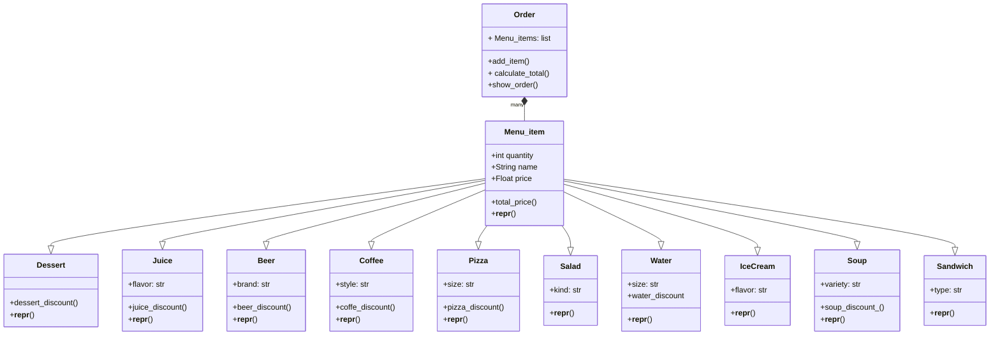

**Diagrama del Menú:**

```mermaid
classDiagram
    Order "many"*-- Menu_item
    Menu_item --|> Dessert
    Menu_item --|> Juice
    Menu_item --|> Beer
    Menu_item --|> Coffee
    Menu_item --|> Pizza
    Menu_item --|> Salad
    Menu_item --|> Water
    Menu_item --|> IceCream
    Menu_item --|> Soup
    Menu_item --|> Sandwich
    Menu_item : +int quantity
    Menu_item : +String name
    Menu_item : +Float price
    Menu_item: +total_price()
    Menu_item: +__repr__()

    class Dessert{  
    +dessert_discount()
    +__repr__()
    }

    class Juice{
    +flavor: str
    +juice_discount()
    +__repr__()
    }

    class Beer{
    +brand: str
    +beer_discount()
    +__repr__()
    }

    class Coffee{
    +style: str
    +coffe_discount()
    +__repr__()
    }

    class Sandwich{
    +type: str
    +__repr__()
    }
    
    class Pizza{
    +size: str
    +pizza_discount()
    +__repr__()  
    }

    class Salad{
    +kind: str
    +__repr__()
    }

    class Water{
    +size: str
    +water_discount
    +__repr__()
    }

    class IceCream{
    +flavor: str
    +__repr__()
    }

    class Soup{
    +variety: str
    +soup_discount_()
    +__repr__()
    }

   class Order{
    + Menu_items: list
    +add_item()
    + calculate_total()
    +show_order()
   }
```
